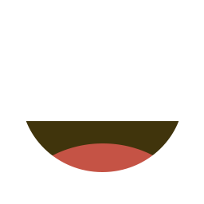

# jimg

> **Note:** The README is inspired from merge-images by Luke Childs but it's not the same package and fonctionnalities

Merge, truncat, compress, resize, convert, edit multiple images into one single image on nodejs and in the browser.

## Install

```
$ npm install --save jimg
```

## Usage

With the following images:

| `/body.png`                               | `/eyes.png`                               | `/mouth.png`                               |
| ----------------------------------------- | ----------------------------------------- | ------------------------------------------ |
|  |  |  |

You can do:

```js
const jimg = require("jimg");

jimg({ images: ["/body.png", "/eyes.png", "/mouth.png"] }).then(
  (b64) => (document.querySelector("img").src = b64)
);
// data:image/png;base64,iVBORw0KGgoAA...
```

Or in the browser

```html
<script src="https://unpkg.com/jimg@1.0.1/dist/index.js"></script>
```

And that would update the `img` element to show this image:


## Saving image

This is how to save an image to a specific location on nodejs or in the browser

```js
jimg({
  path: "./merged.png",
  images: ["/body.png", "/eyes.png", "/mouth.png"],
}).then((b64) => (document.querySelector("img").src = b64));
// data:image/png;base64,iVBORw0KGgoAA...
```

## Positioning and resizing

Those source png images were already the right dimensions to be overlaid on top of each other. You can also supply an array of objects with x/y co-ords to manually position each image or resize an image with width/height:

```js
jimg({
    images: [
        { path: 'body.png', x: 0, y: 0 },
        { path: 'eyes.png', x: 32, y: 0, width: 256, height: 256 },
        { path: 'mouth.png', x: 16, y: 0 }
    ]
})
  .then(b64 => ...);
// data:image/png;base64,iVBORw0KGgoAA...
```

Using the same source images as above would output this:


### Opacity

The opacity can also be tweaked on each image.

```js
jimg({
    images: [
        { path: 'body.png' },
        { path: 'eyes.png', opacity: 0.7 },
        { path: 'mouth.png', opacity: 0.3 }
    ]
})
  .then(b64 => ...);
// data:image/png;base64,iVBORw0KGgoAA...
```


### Truncat

You can simply truncat an image by using truncat property (x, y, width and height are optionals)

```js
jimg({
    images: ["/body.png", "/eyes.png", "/mouth.png"],
    truncat: { x: 0, y: 0, width: 128, height: 128 }
  }).then(
  b64 => ...
);
// data:image/png;base64,iVBORw0KGgoAA...
```

Which will look like this:


## Quality

You can custom the quality of the image to compress it. Default is 0.92.

```js
jimg({
    images: ["/body.png", "/eyes.png", "/mouth.png"],
    quality: 0.7
  }).then(
  b64 => ...
);
// data:image/png;base64,iVBORw0KGgoAA...
```

## Format

Custom the format in jpg for example

```js
jimg({
    images: ["/body.png", "/eyes.png", "/mouth.png"],
    format: 'image/jpeg'
  }).then(
  b64 => ...
);
// data:image/png;base64,iVBORw0KGgoAA...
```

## Canvas

Custom the canvas. Can be an instance of document canvas or nodejs canvas package.

```js
jimg({
    images: ["/body.png", "/eyes.png", "/mouth.png"],
    canvas: document.querySelector("canvas") //of createCanvas()
  }).then(
  b64 => ...
);
// data:image/png;base64,iVBORw0KGgoAA...
```

## License

MIT © yoannchb
